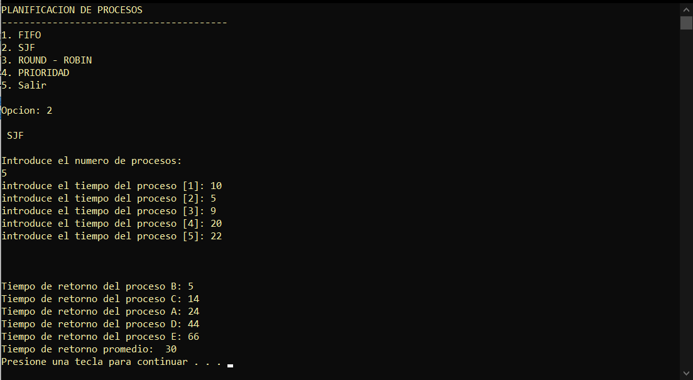
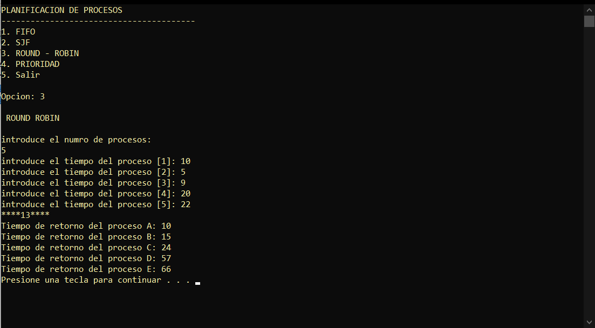
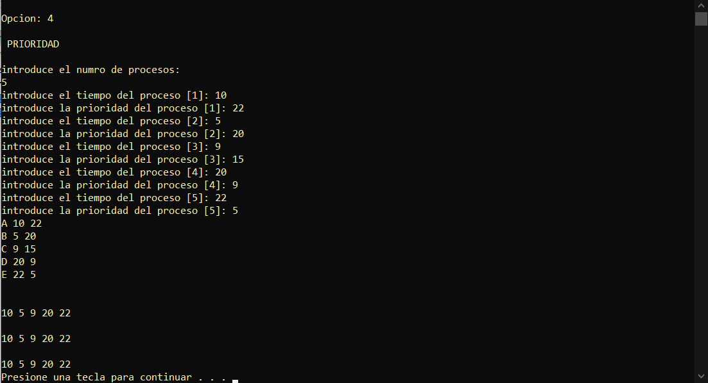

# Administracion de procesos
Este programa simula la administracion de procesos de un sistema operativo, donde cada proceso se le asigna el tiempo que tardara en ejecutarse y el Sistema Operativo los ejecutara en base a los metodos:

* [FIFO](#fifo)
* [SJF](#sjf)
* [Round Robin](#round-robin)
* [Prioridad](#prioridad)

## FIFO

## SJF

## Round Robin

## Prioridad
